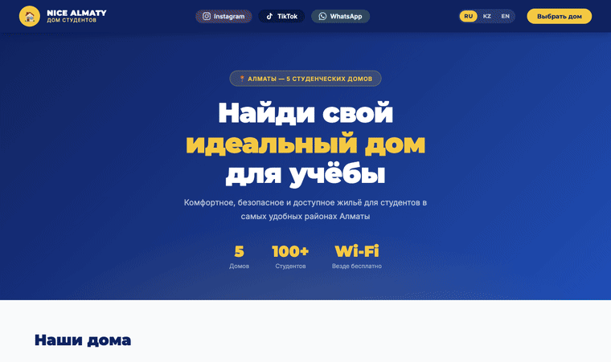
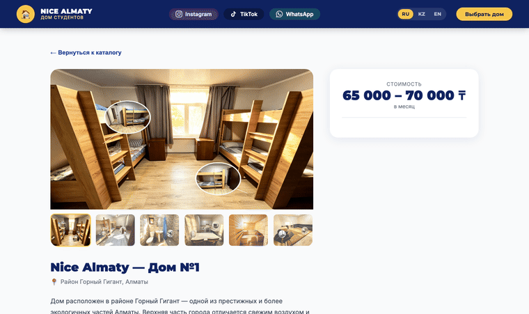

<div align="center">


<p>
  
  
  
  
  
</p>

<a href="https://nice-almaty-site.vercel.app">
  
</a>

<br/><br/>



</div>

<br/>

## 🏠 О проекте

**Nice Almaty** — лендинг сети студенческих домов в Алматы. Помогает студенту за минуту найти жильё рядом с университетом: фотографии, цены, удобства и готовые маршруты общественного транспорта до каждого вуза.

Сайт полностью статический — чистый **HTML, CSS и JavaScript**, без фреймворков и сборки. Вся информация (дома, фото, маршруты) встроена прямо в страницу, поэтому он открывается мгновенно и не требует бэкенда.

<div align="center">

### 🌐 [**nice-almaty-site.vercel.app**](https://nice-almaty-site.vercel.app)

</div>

## ✨ Возможности

- 🌍 **3 языка** — Русский · Қазақша · English с мгновенным переключением
- 🏘️ **5 домов** — карточки с ценами, районами и статусом мест
- 📸 **Фотогалереи** — реальные фото каждого дома
- 🚌 **Маршруты до вузов** — какой автобус и сколько ехать до каждого университета
- 💬 **Связь в один тап** — WhatsApp, Instagram, TikTok
- 📱 **Адаптивность** — телефон, планшет, десктоп
- ⚡ **Чистая статика** — деплой на Vercel / Netlify, нулевой бэкенд

## 🚌 Маршруты до университетов

<div align="center">
  
</div>

Изюминка проекта. Для каждого дома показывается список вузов в формате **ВУЗ — автобусы — ~минуты**:

- 🚌 Несколько вариантов автобусов на выбор
- 🔁 Маршруты с пересадкой отмечены стрелкой (например, `15 → 128`)
- ⏱️ Примерное время в пути
- 🏫 Названия вузов крупными буквами — `UIB`, `КБТУ`, `МУИТ`, `ALMAU`, `КАНЗАИУ` …

Данные встроены прямо в страницу, поэтому виджет работает **без API и серверных функций**.

## 🤖 AI-ассистент

Встроенный чат-бот (кнопка 💬 внизу справа) отвечает на вопросы студентов о **свободных местах**, ценах, маршрутах до вузов и удобствах — на русском, казахском и английском.

- **Модель:** DeepSeek V4 Flash через serverless-функцию [`api/chat.js`](api/chat.js) на Vercel.
- **Факты о домах (правишь руками):** [`data/houses/dom-1.md … dom-6.md`](data/houses/) — авторитетный источник для бота: район, пол, описание, цены, вузы и **маршруты автобусов**. Модель отвечает **только** по этим файлам («не выдумывай»). Чтобы изменить факт — правишь `.md`, коммитишь, деплоишь (без сборки; Vercel подхватывает папку через `includeFiles`).
- **Адреса:** бот **никогда** не пишет точный адрес — только район. Адресов нет ни в файлах домов, ни в JSON, отдаваемых модели.
- **Свободные места (числа):** берутся из таблицы `Чат бот.xlsx`. Скрипт [`scripts/sync_availability.py`](scripts/sync_availability.py) генерирует [`data/availability.json`](data/availability.json) (комнаты) и [`data/site-facts.json`](data/site-facts.json) (вузы, FAQ, контакты — без адресов).
- **Приватность:** ФИО жильцов и имена сотрудников не читаются и не выгружаются. Сам `.xlsx` исключён из git и деплоя.

### Обновить данные о местах

После правки таблицы перегенерируйте JSON:

```bash
python3 scripts/sync_availability.py   # → data/site-facts.json + data/availability.json (без персональных данных)
```

### Переменные окружения (Vercel)

| Переменная | Обязательна | Назначение |
|------------|:---:|------------|
| `DEEPSEEK_API_KEY` | да | Ключ DeepSeek API |
| `DEEPSEEK_MODEL` | нет | Точный id модели «V4 Flash» (по умолчанию `deepseek-chat`) |
| `DEEPSEEK_BASE_URL` | нет | По умолчанию `https://api.deepseek.com` |
| `OPENAI_API_KEY` или `GROQ_API_KEY` | для ГС | Расшифровка голосовых в WhatsApp (Whisper). См. [WHATSAPP_SETUP.md](WHATSAPP_SETUP.md) |

```bash
vercel env add DEEPSEEK_API_KEY
vercel dev        # локальный запуск с работающей функцией /api/chat
```

Без ключа виджет не ломается — он показывает запасное сообщение со ссылкой на WhatsApp.

### 💬 Тот же бот в WhatsApp (через Wazzup24)

Веб-чат и WhatsApp-бот используют один «мозг» ([lib/bot.js](lib/bot.js)) и одни данные — отвечают одинаково, имена жильцов никуда не уходят. Входящие сообщения приходят на [api/wazzup-webhook.js](api/wazzup-webhook.js), ответ уходит через Wazzup API.

Пошаговая настройка, тест и **выключатель «стоп»** — в [WHATSAPP_SETUP.md](WHATSAPP_SETUP.md).

## 🛠️ Технологии

| Слой | Стек |
|------|------|
| **Frontend** | HTML5 · CSS3 · Vanilla JavaScript (без фреймворков) |
| **Шрифты** | Inter · Montserrat (Google Fonts) |
| **i18n** | Своя система переключения RU / KZ / EN |
| **Хостинг** | Vercel (прод) + конфиг для Netlify |
| **Данные** | Встроены в страницу — дома, фото, маршруты |

## 🚀 Локальный запуск

```bash
git clone https://github.com/crubn/nice-almaty-site.git
cd nice-almaty-site

# Просто открой файл в браузере:
open nice-almaty.html

# …или подними любой статический сервер:
python3 -m http.server 8000   # → http://localhost:8000/nice-almaty.html
```

Сборка не нужна — это один HTML-файл со встроенными стилями, логикой и данными.

## 📁 Структура

```text
nice-almaty-site/
├── nice-almaty.html      # Весь сайт: разметка + стили + логика + данные
├── assets/               # Демо-GIF и обложка для README
│   ├── demo-home.gif
│   ├── demo-routes.gif
│   └── hero.png
├── IMG_*.JPG             # Фотографии домов
├── vercel.json           # Vercel: rewrite / → страница, cleanUrls
├── netlify.toml          # Netlify: redirect / → /nice-almaty.html
└── README.md
```

## 📬 Контакты

- 📸 Instagram — [@nice_almaty](https://www.instagram.com/nice_almaty)
- 💬 WhatsApp — [+7 777 073 99 90](https://wa.me/77770739990)
- 🎵 TikTok — [@nice_almaty](https://www.tiktok.com/@nice_almaty)

<div align="center">


<sub>Сделано с 💛💙 в Алматы · © 2025 Nice Almaty</sub>

</div>
